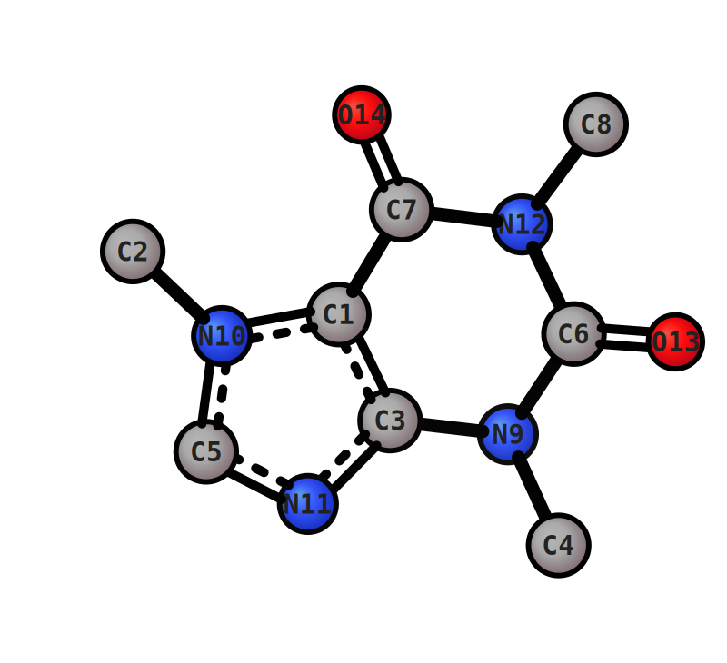
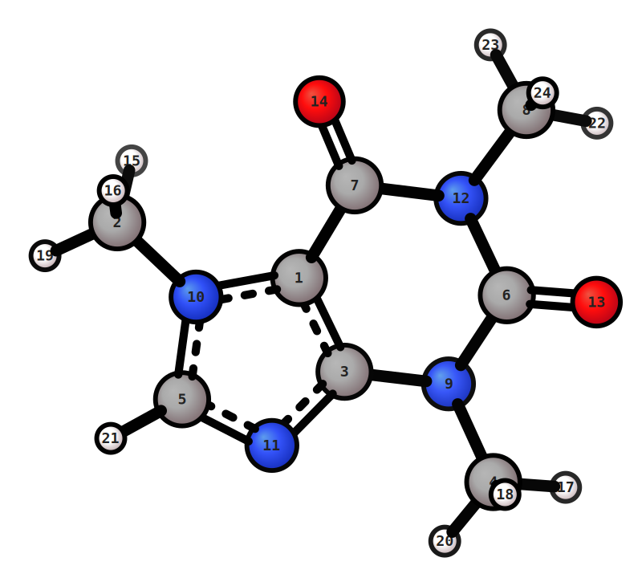
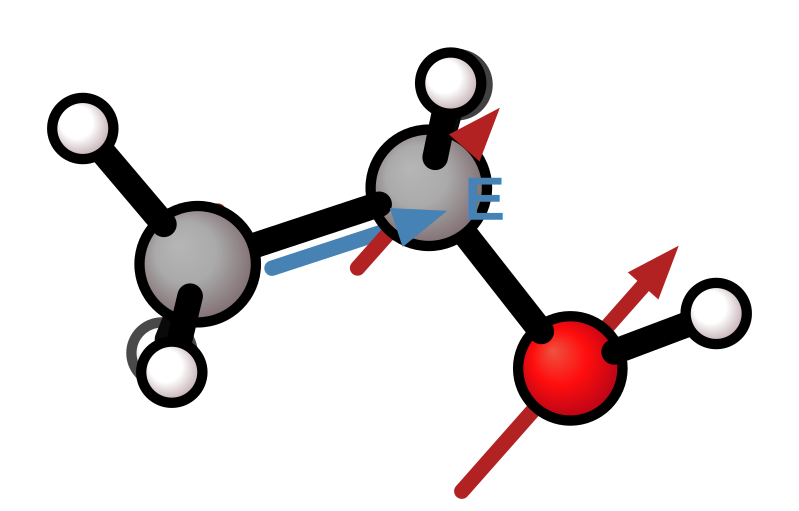

# Annotations & measurements

> **Python.** All `xyzrender` flags below map 1:1 to keyword arguments on `render()` (`--foo bar` → `foo="bar"`). A few have shapes worth flagging:
>
> - `-l TOKEN ...` (repeatable) → `labels=["1 2 d", "1 2 3 a", ...]` — each spec is one string
> - `--label FILE` → `label_file="annot.txt"`
> - `--stereo` / `--stereo point,ez` → `stereo=True` or `stereo=["point", "ez"]`
> - `--vector FILE` → `vector="dip.json"` (path) **or** `vector=[{...}, {...}]` (list of dicts inline)
> - `--measure` is a **separate top-level function**, not a `render()` kwarg: `from xyzrender import measure; measure(mol)` returns the data as a dict (atom indices 0-based on output, see [Geometry measurements](../python_api.md#geometry-measurements))
>
> See the [Python API guide](../python_api.md) for the full surface.

## Atom indices

Add atom index labels centred on every atom in the SVG with `--idx`. Three format options:

| Symbol + index (default) | Index only |
|-------------------------|-----------|
|  |  |

```bash
xyzrender caffeine.xyz --idx                         # symbol + index (C1)
xyzrender caffeine.xyz --hy --idx n --label-size 25  # index only (1)
xyzrender caffeine.xyz --hy --idx s                  # symbol only (C)
```

## SVG annotations (`-l`)

Annotate bonds, angles, atoms, or dihedrals with computed or custom text. The **last token** of each spec determines its type. All atom indices are **1-based**. `-l` is repeatable.

| Spec | SVG output |
|------|------------|
| `-l 1 2 d` | Distance text at the 1–2 bond midpoint |
| `-l 1 d` | Distance on every bond incident to atom 1 |
| `-l 1 2 3 a` | Arc at atom 2 (vertex) + angle value |
| `-l 1 2 3 4 t` | Colored line 1-2-3-4 + dihedral value near bond 2–3 |
| `-l 1 +0.512` | Custom text near atom 1 |
| `-l 1 2 NBO` | Custom text at the 1–2 bond midpoint |

| Distances + angles + dihedrals | Custom annotation |
|-------------------------------|------------------|
|  |  |

```bash
xyzrender caffeine.xyz -l 13 6 9 4 t -l 1 a -l 14 d -l 7 12 8 a -l 11 d
xyzrender caffeine.xyz -l 1 best -l 2 "NBO: 0.4"
```

```python
render(mol, labels=["13 6 9 4 t", "1 a", "14 d", "7 12 8 a", "11 d"])
render(mol, labels=["1 best", "2 NBO: 0.4"])
```

## Bulk label file (`--label`)

Same syntax as `-l`, one spec per line. Lines whose first token is not an integer (e.g. CSV headers) are silently skipped. Comment lines (`#`) and quoted labels are supported.

```{image} ../../../examples/images/sn2_ts_label.svg
:width: 50%
:alt: Bulk label file example
```

```text
# sn2_label.txt
2 1 d
1 22 d
2 1 22 a
```

```bash
xyzrender sn2.out --ts --label sn2_label.txt --label-size 40
```

```python
render("sn2.out", ts_detect=True, label_file="sn2_label.txt", label_font_size=40)
```

## Stereochemistry (`--stereo`)

Add stereochemistry labels derived from 3D geometry (via [xyzgraph](https://github.com/aligfellow/xyzgraph)). Detects R/S point chirality, E/Z double bonds, axial, planar (metallocene and CIP), and helical chirality.

| Isothiourea (R/S, E/Z, planar) | TS with stereo (Mn-H₂) |
|---|---|
|  |  |

```bash
xyzrender isothio_xtb.xyz -c 1 --stereo
xyzrender mn-h2.log --ts --stereo --no-orient
```

Filter to specific stereo classes with a comma-separated list:

```bash
xyzrender mol.xyz --stereo point,ez      # only R/S and E/Z
xyzrender mol.xyz --stereo point          # only R/S
```

Valid classes: `point`, `ez`, `axis`, `plane`, `helix`.

Two display modes for R/S labels: `--stereo-style atom` (default, centered on atom) and `--stereo-style label` (offset like other annotations).

> **Note:** `--stereo` with `--idx` will overlap labels on stereocenters since both draw text at the atom position. Use `--stereo-style label` to offset R/S labels if combining with `--idx`.

## Atom property colormap

Per-atom scalar colouring (partial charges, NMR shifts, Fukui indices) has its own dedicated page — see [Atom Colormap](cmap.md).

## Vector arrows

Overlay arbitrary 3D vectors as arrows on the rendered image via a JSON file. Useful for dipole moments, forces, electric fields, transition vectors, etc.

| Dipole moment | Rotation |  
|-------------|-------------|  
|  |  |  


```bash
xyzrender ethanol.xyz --vector ethanol_dip.json -o ethanol_dip.svg
```

```python
render(mol, vector="ethanol_dip.json")                              # path to a JSON file
render(mol, vector=[{"origin": "com",
                     "vector": [1.03, -0.04, -1.33],
                     "color": "red", "label": "μ"}])                # inline list of dicts
```

Each entry in the JSON array defines one arrow:

| Key | Type | Default | Description |
|-----|------|---------|-------------|
| `vector` | `[vx, vy, vz]` | *required* | Three numeric components (x,y,z). Use the same coordinate units as the input (Å). Example: `[1.2, 0.0, 0.5]`. |
| `origin` | `"com"` / integer / `[x,y,z]` | `"com"` | Tail location: `"com"` = molecule centroid; integer = 1-based atom index from the input XYZ; list = explicit coordinates. |
| `color` | `"#rrggbb"` / named | `"#444444"` | Arrow color. Accepts hex (`#e63030`) or CSS color names (`steelblue`). |
| `label` | string | `""` | Text placed near the arrowhead (e.g. "μ"). Suppressed when a dot or × symbol is rendered (see below). |
| `scale` | float | `1.0` | Per-arrow multiplier applied on top of `--vector-scale`. Final arrow length = `scale * --vector-scale * |vector|`. |

**Near-Z rendering (dot and × symbols)**

When an arrow points nearly along the viewing axis its 2D projected length becomes shorter than the arrowhead size.  In that case a compact symbol is drawn at the arrow origin instead:

- **•** (filled dot) — the tip is closer to the viewer (arrow coming out of the screen).
- **×** (two crossed lines) — the tip is farther from the viewer (arrow going into the screen).

The label is suppressed for these compact symbols.  Once the viewing angle changes enough for the projected shaft to exceed the arrowhead size, the full arrow and label are restored automatically.  This behaviour is particularly visible in GIF rotations: as a lattice axis arrow passes through the viewing direction it transitions smoothly between dot, ×, and full-arrow rendering.

**Example — Dipole Moment:**

```json
{
  "anchor": "center",
  "vectors": [
    {
      "origin": "com",
      "vector": [
        1.0320170291976951,
        -0.042708195030485986,
        -1.332397645862797
      ],
      "color": "red",
      "label": "μ"
    }
  ]
}
```

**Example — forces on heavy atoms due to E field:**

| Forces | Rotation |  
|-------------|-------------|  
|  |  |  

```text
{
  "anchor": "center",
  "units": "eV/Angstrom",
  "vectors": [
    {
      "origin": 1,
      "vector": [-0.318, -0.438, 0.368],
      "color": "red"
    },
    ...
  ]
}
```

## Bond measurements (`--measure`)

Print bonded distances, angles, and dihedral angles to stdout. The SVG is still rendered as normal.

```bash
xyzrender ethanol.xyz --measure          # all: distances, angles, dihedrals
xyzrender ethanol.xyz --measure d        # distances only
xyzrender ethanol.xyz --measure d a      # distances and angles
```

`measure()` in Python is a separate top-level function — it does not render anything and returns the data as a dict (atom indices are 0-based on output):

```python
from xyzrender import measure

data = measure(mol)                       # all: distances, angles, dihedrals
data = measure("ethanol.xyz")             # also accepts a path directly
data = measure(mol, modes=["d", "a"])     # distances + angles only

for i, j, d in data["distances"]:
    print(f"  {i+1}-{j+1}: {d:.3f} Å")
```

```text
Bond Distances:
     C1 - C2     1.498Å
     C1 - H4     1.104Å
Bond Angles:
     C2 - C1 - H5     109.62°
Dihedral Angles:
     H5 - C1 - C2 - O3      -55.99°
```
