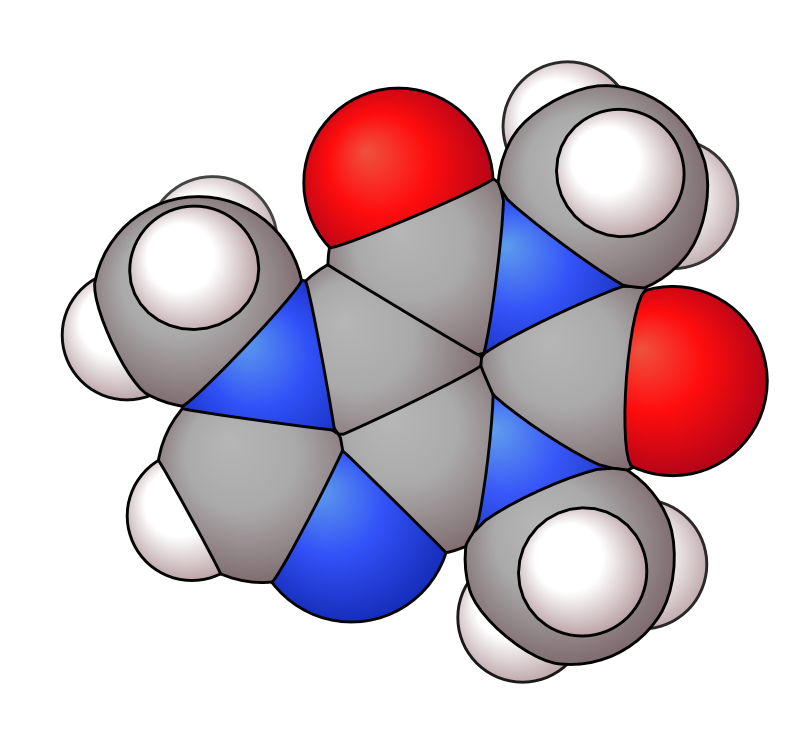
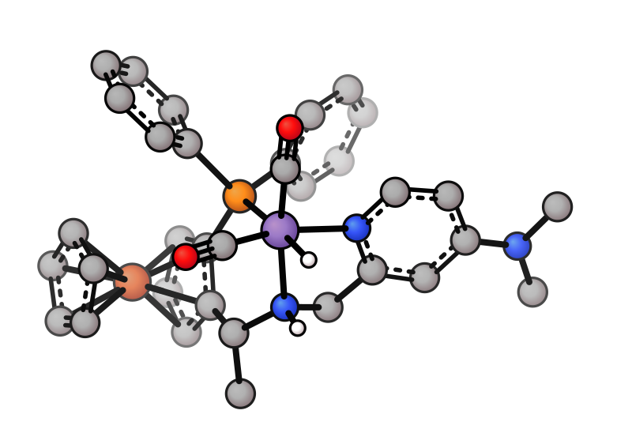

# Basics

> **Python.** Most `xyzrender` flags below map 1:1 to keyword arguments on `render()` (`--config flat` → `config="flat"`, `--hy` → `hy=True`, `--vdw "1-6"` → `vdw=[1, 2, 3, 4, 5, 6]` or `vdw="1-6"`). Input/parsing options (e.g. `--charge`, `--smiles`) go to `load()` instead. Most snippets on this page are CLI; equivalent Python is shown where the call shape adds something (lists for selections, kwargs for DoF/glow strength). See the [Python API guide](../python_api.md).

## Presets

| Default | Flat | Paton (PyMOL-like) | Bubble | vdW |
|---------|------|-------------------|--------|-----|
|  |  |  |  |  |

| Tube | Wire | Pmol | MTube | BTube |
|------|------|------|-------|-------|
|  |  |  |  |  |

```bash
xyzrender caffeine.xyz                        # default
xyzrender caffeine.xyz --config flat          # flat: no gradient
xyzrender caffeine.xyz --config paton         # paton: PyMOL-style
xyzrender caffeine.xyz --config pmol          # pmol: ball-and-stick + element-coloured bonds (PyMOL-inspired)
xyzrender caffeine.xyz --config bubble --hy   # space-filling-like
xyzrender caffeine.xyz --config vdw           # vdw: true space-filling, interlocked silhouettes
xyzrender caffeine.xyz --config tube          # tube: cylinder-shaded sticks
xyzrender caffeine.xyz --config mtube         # mtube: metal tube with edge stroke
xyzrender caffeine.xyz --config btube         # btube: ball-and-tube with element-coloured bonds
xyzrender caffeine.xyz --config wire          # wire: thin element-coloured lines
```

The `paton` style is inspired by the clean styling used by [Rob Paton](https://github.com/patonlab) through PyMOL.

The `pmol` preset is a PyMOL-inspired style that keeps atoms visible and adds split element-coloured bonds with cylinder shading.

The `tube` and `wire` presets hide atom circles and colour each bond by its endpoint atoms, with a cylinder shading gradient for a 3D look. The `tube` preset uses thick bonds; `wire` uses thin bonds.

## Metal tube

The `mtube` preset is designed for metal complexes: non-metals render as tube-only, while metals are highlighted via a preset-defined region. Combines well with `--unbond pi` to remove pi-coordination clutter.

| Caffeine (mtube) | mtube + `unbond pi` |
|------------------|---------------------|
|  |  |

```bash
xyzrender caffeine.xyz --config mtube
xyzrender mnh.xyz --config mtube --unbond pi --hy
```

## Haptic centroid bonds

Replace the individual metal-ring bonds with a single dotted bond from the metal to the ring centroid.

| Default | Haptic |
|---------|--------|
|  |  |

```bash
xyzrender mnh.xyz --haptic
```

## Hydrogen display

| All H | Some H | No H |
|-------|--------|------|
|  |  |  |

```bash
xyzrender ethanol.xyz --hy              # all H
xyzrender ethanol.xyz --hy 7 8 9        # specific H atoms (1-indexed)
xyzrender ethanol.xyz --no-hy           # no H
```

## Bond orders

| Aromatic | Kekulé |
|----------|--------|
|  |  |

```bash
xyzrender benzene.xyz --hy              # aromatic notation (default)
xyzrender caffeine.xyz --bo -k          # Kekulé bond orders
```

## vdW spheres

| All atoms | Selected atoms | Paton style |
|-----------|---------------|-------------|
|  |  |  |

```bash
xyzrender asparagine.xyz --hy --vdw                   # all atoms
xyzrender asparagine.xyz --hy --vdw "1-6"             # atoms 1–6 only
xyzrender asparagine.xyz --hy --vdw --config paton    # paton style
```

### Interlocked spheres

By default the `--vdw` overlay draws each sphere as an interlocked silhouette: where neighbouring spheres overlap, the cut between them is sampled along the actual 3D intersection circle and shared between both polygons. Turn it off with `--no-vdw-interlocking` to fall back to plain `<circle>` elements.

The visibility-filter + convex-hull silhouette approach is adapted from [CineMol](https://github.com/moltools/CineMol) by David Meijer.  
- D. Meijer, M.H. Medema and J.J.J. van der Hooft, *J. Cheminform.*, 2024, **16**, 58 ([DOI](https://doi.org/10.1186/s13321-024-00851-y)).

The interlocking path also drives the dedicated space-filling preset:

```bash
xyzrender caffeine.xyz --config vdw           # space-filling render
xyzrender caffeine.xyz --config bubble --hy   # large atoms, no interlocking
```

`--config vdw` enables `atom_interlocking` for the primary atom layer (atoms sized at vdW radii, drawn as interlocked silhouettes — no separate overlay needed). The `bubble` preset leaves it off: bubble atoms overlap only slightly, so interlocking would trigger, but at the cost of inflating the size of the SVG, with little visual change. The threshold of `vdw_interlock_samples` and the `min_clip_fraction` cutoff trade off file size against the smoothness of the cut; the defaults skip the polygon path whenever the visible cut is too small to distinguish from a plain circle.

Outline on the `--vdw` overlay is independent of the primary atoms:

```bash
xyzrender mof.xyz --vdw --vdw-outline-width 3 --vdw-outline-color black
xyzrender mof.xyz --vdw --vdw-outline-width 0   # no outline
```

`--vdw-outline-width` / `--vdw-outline-color` fall back to `--atom-stroke-width` / `--atom-stroke-color` when unset, so they only diverge when you set them explicitly.

## Depth of field

Blur back atoms while keeping front atoms sharp. Uses SVG `feGaussianBlur` filters.

| DoF | Rotation | 
|-----|----------|
|  |  | 

```bash
xyzrender caffeine.xyz --dof --no-orient                    # default strength
xyzrender caffeine.xyz --dof --dof-strength 6.0 --no-orient # stronger blur
```

```python
render(mol, dof=True, orient=False)
render(mol, dof=True, dof_strength=6.0, orient=False)
```

## Glow

Render selected atoms with a blurred glow layer under the atom circle.

| Glow (N,O atoms) |
|------------------|
|  |

```bash
xyzrender caffeine.xyz --glow "N,O" --glow-strength 4 -o caffeine_glow.svg
```
