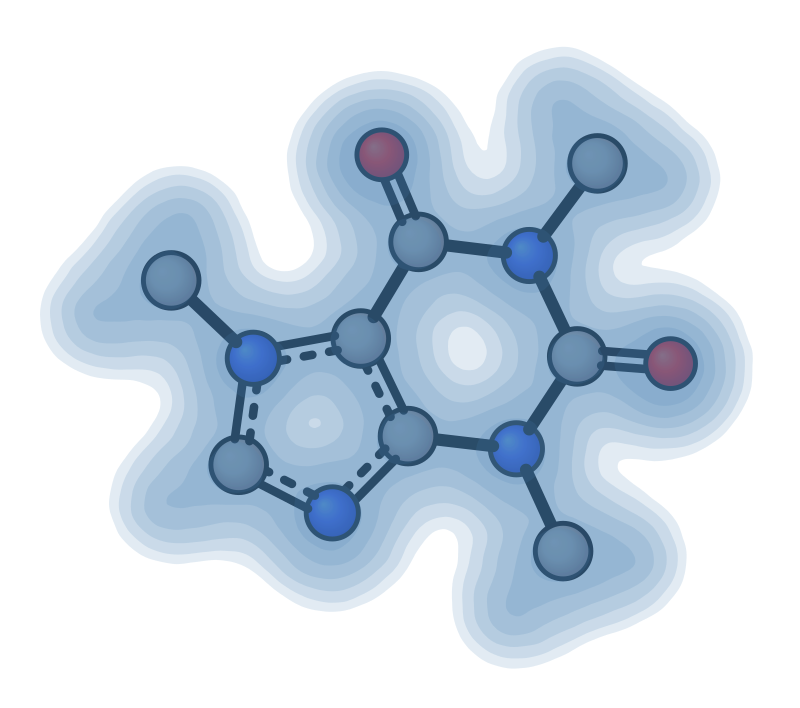
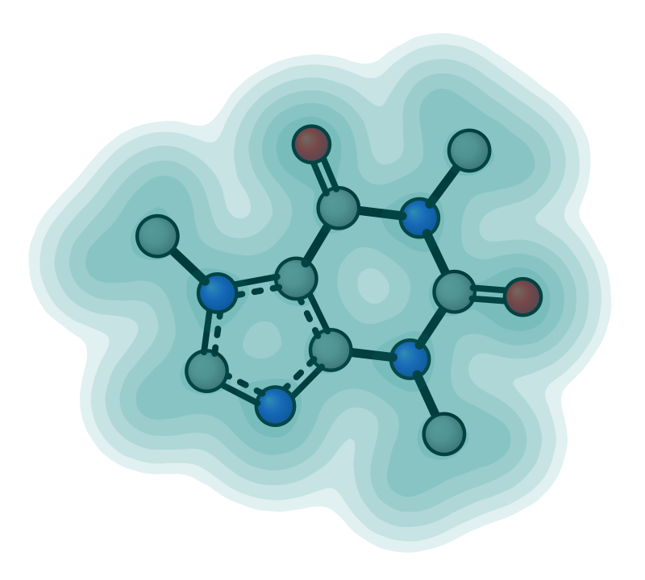
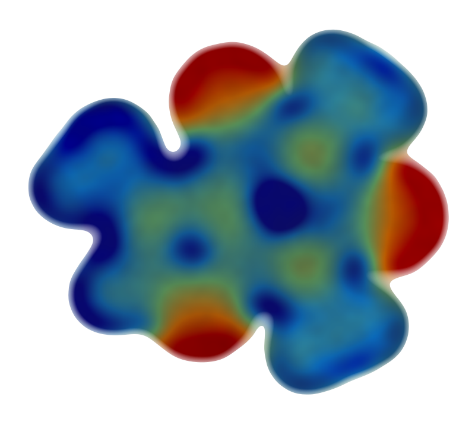
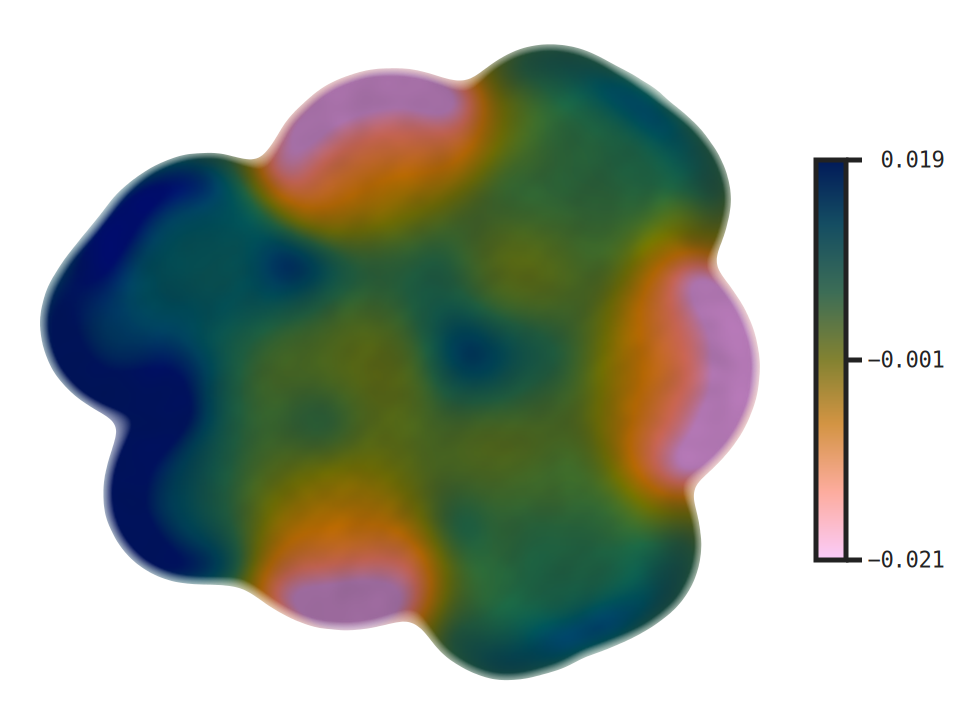
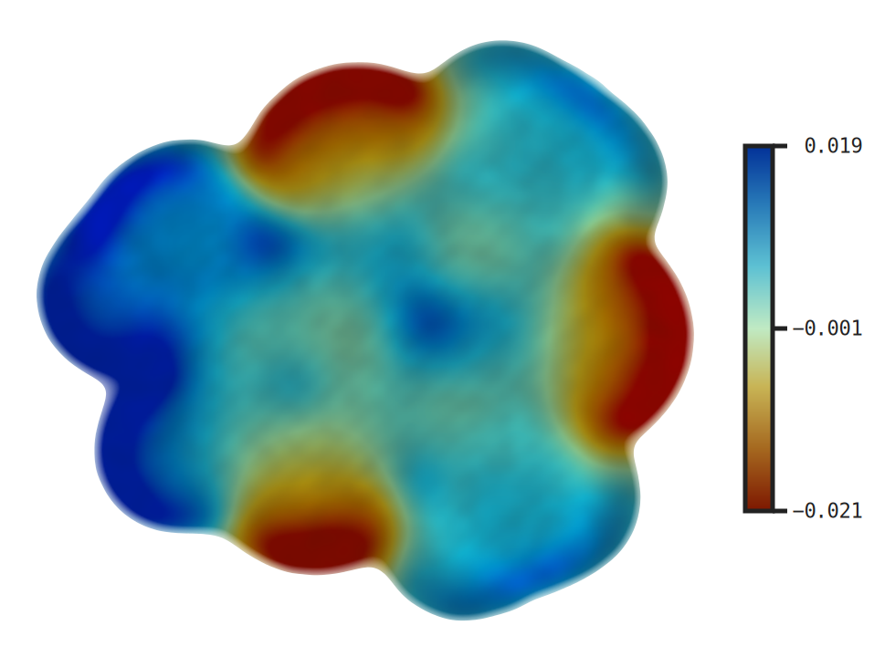
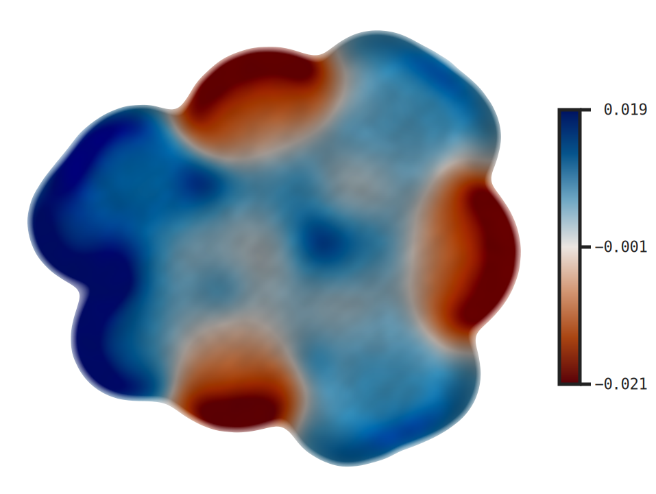
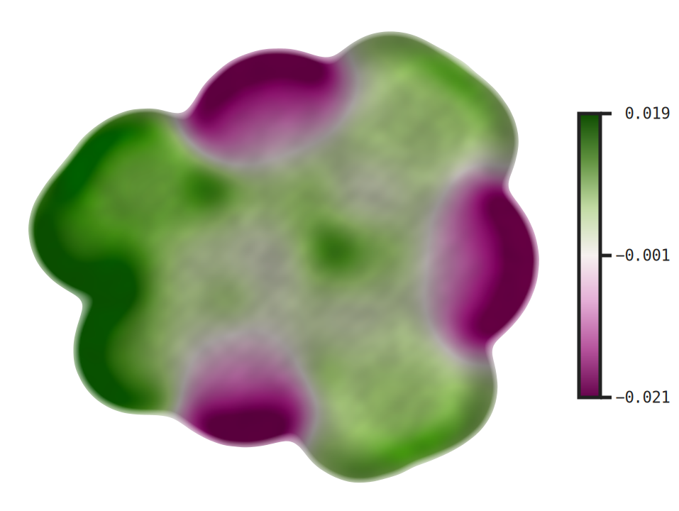
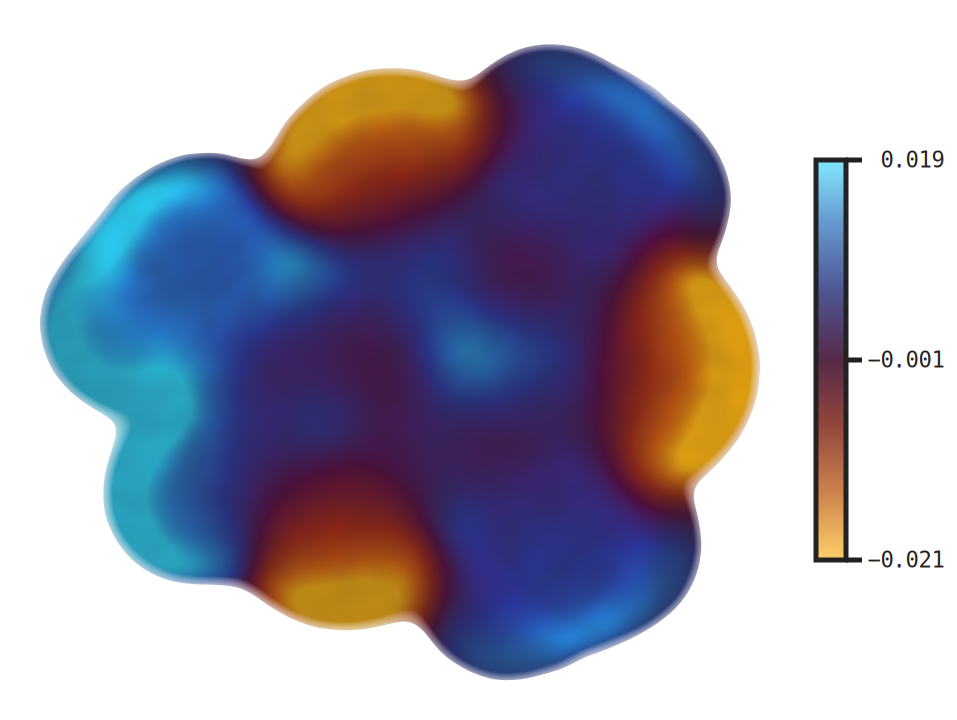

# Electron Density and ESP

```{note}
Surface plots are schematic 2D representations suitable for figures. For quantitative isosurface analysis, use a dedicated 3D viewer (VMD, PyMOL).
```

Cube files are typically generated by [ORCA](https://www.faccts.de/docs/orca/6.1/manual/contents/utilitiesvisualization/utilities.html?q=orca_plot&n=0#orca-plot) (`orca_plot`) or Gaussian (`cubegen`).

> **Python.** Most `xyzrender` flags below map 1:1 to keyword arguments on `render()` (`--foo bar` → `foo="bar"`). The cube file is opened with `load()`; the surface flags below are `render()` kwargs. The shapes worth flagging are `--cmap-range VMIN VMAX` → `cmap_range=(-0.03, 0.03)` (tuple) and loading a cube once for repeated renders. ESP also takes a path: `render(mol_dens, esp="caffeine_esp.cube", cmap_palette="coolwarm", cmap_range=(-0.03, 0.03), cbar=True)`. See the [Python API guide](../python_api.md).

## Electron density surface

Render electron density isosurfaces with `--dens`. The surface is rendered as a depth-graded translucent shell — multiple concentric contour rings stacked with partial opacity so the centre appears more opaque than the edges.

| Default | Custom iso (0.01) |
|---------|------------------|
|  |  |

| Custom color + opacity | Rotation |
|-----------------------|---------|
|  |  |

```bash
xyzrender caffeine_dens.cube --dens -o caffeine_dens.svg
xyzrender caffeine_dens.cube --dens --iso 0.01 -o caffeine_dens_iso.svg
xyzrender caffeine_dens.cube --dens --dens-color teal --opacity 0.75 -o caffeine_dens_custom.svg
xyzrender caffeine_dens.cube --dens --gif-rot -go caffeine_dens.gif
```

| Contour | Dot |
|---------|-----|
|  |  |

```bash
xyzrender caffeine_dens.cube --dens --surface-style contour -o caffeine_dens_contour.svg
xyzrender caffeine_dens.cube --dens --surface-style dot -o caffeine_dens_dot.svg
```

| Flag | Description |
|------|-------------|
| `--dens` | Enable electron density surface rendering |
| `--iso` | Isosurface threshold (default: 0.05 — smaller value = larger surface) |
| `--opacity` | Surface opacity multiplier (default: 1.0) |
| `--surface-style STYLE` | `solid`, `contour`, `dot` (density ignores `mesh` — uses `contour` instead) |
| `--dens-color COLOR` | Surface color as hex or [named color](https://matplotlib.org/stable/gallery/color/named_colors.html) (default: `steelblue`) |

```{note}
For density surfaces, `mesh` falls back to `contour` automatically (the molecular envelope is too smooth for grid-based warping). ESP surfaces use raster rendering and ignore `--surface-style`.
```

## Electrostatic potential (ESP) surface

Map electrostatic potential onto the density isosurface using two cube files: density (main input) and ESP (`--esp`). Both must come from the same calculation (identical grid). Colored **blue** (positive/electron-poor) → **green** (zero) → **red** (negative/electron-rich).

| Default | With colorbar | Coolwarm + colorbar | Fixed range (`±0.03`) | Custom iso + opacity |
|---------|---------------|---------------------|-----------------------|----------------------|
|  |  |  |  |  |

```bash
xyzrender caffeine_dens.cube --esp caffeine_esp.cube -o caffeine_esp.svg
xyzrender caffeine_dens.cube --esp caffeine_esp.cube --iso 0.005 --opacity 0.75 -o caffeine_esp_custom.svg
xyzrender caffeine_dens.cube --esp caffeine_esp.cube --cbar -o caffeine_esp_cbar.svg
xyzrender caffeine_dens.cube --esp caffeine_esp.cube --cmap-palette coolwarm --cbar -o caffeine_esp_coolwarm.svg
```

For cross-structure comparison, prefer a fixed manual range and show the colorbar explicitly:

```bash
xyzrender caffeine_dens.cube --esp caffeine_esp.cube --cmap-palette coolwarm --cmap-range -0.03 0.03 --cbar -o caffeine_esp_cmap_range.svg
```

This keeps the ESP scale identical between renders, which is usually more informative than letting each figure auto-scale independently.

If you want an automatic zero-centered range instead, use:

```bash
xyzrender caffeine_dens.cube --esp caffeine_esp.cube --cmap-symm --cmap-palette coolwarm --cbar -o caffeine_esp_symm.svg
```

`--cmap-symm` chooses a symmetric range about zero using `[-max(|v|), +max(|v|)]`, where `v` is the plotted ESP data. This is useful with diverging palettes such as `coolwarm` when you want balanced positive/negative coloring without manually choosing bounds. For direct figure-to-figure comparison, prefer an explicit fixed range such as `--cmap-range -0.003 0.003`.

### Available palettes

`--cmap-palette NAME` selects any of the 11 built-in palettes. The default for ESP is `rainbow` (the maroon → midnight blue scale used in the gallery above); for `--cmap` (atom property colormaps) the default is `viridis`. The full list:

| Palette | Notes |
|---------|-------|
| `viridis` | Sequential, perceptually uniform; `--cmap` default |
| `plasma` | Sequential, perceptually uniform |
| `spectral` | Diverging, 7-stop classic scientific palette |
| `coolwarm` | Diverging blue → white → red (ESP-friendly) |
| `RdBu` | Diverging red → white → blue (ESP-friendly) |
| `rainbow` | Diverging maroon → midnight; ESP default |
| `batlow` | CVD-safe, perceptually uniform ([Crameri](https://www.fabiocrameri.ch/colourmaps/)) |
| `roma` | CVD-safe diverging |
| `vik` | CVD-safe diverging |
| `bam` | CVD-safe diverging |
| `managua` | CVD-safe diverging |

```bash
# the five CVD-safe diverging options
xyzrender caffeine_dens.cube --esp caffeine_esp.cube --cmap-palette batlow  --cbar -o caffeine_esp_batlow.svg
xyzrender caffeine_dens.cube --esp caffeine_esp.cube --cmap-palette roma    --cbar -o caffeine_esp_roma.svg
xyzrender caffeine_dens.cube --esp caffeine_esp.cube --cmap-palette vik     --cbar -o caffeine_esp_vik.svg
xyzrender caffeine_dens.cube --esp caffeine_esp.cube --cmap-palette bam     --cbar -o caffeine_esp_bam.svg
xyzrender caffeine_dens.cube --esp caffeine_esp.cube --cmap-palette managua --cbar -o caffeine_esp_managua.svg
```

| batlow | roma | vik | bam | managua |
|--------|------|-----|-----|---------|
|  |  |  |  |  |

For accessibility and reproducibility we recommend the CVD-safe block (`batlow`, `roma`, `vik`, `bam`, `managua`) — all five are perceptually uniform and remain interpretable under deuteranopia / protanopia simulation. For publication, pair any diverging palette with `--cmap-symm` or an explicit `--cmap-range` so zero ESP maps to the palette midpoint.

| Flag | Description |
|------|-------------|
| `--esp CUBE` | ESP cube file to map onto the density isosurface |
| `--iso` | Isosurface threshold for the density surface (default: 0.05) |
| `--opacity` | Surface opacity multiplier (default: 1.0) |
| `--cmap-range VMIN VMAX` | Explicit ESP plotting range; recommended for direct comparison across structures |
| `--cmap-symm` | Automatic zero-centered symmetric range: `[-max(|v|), +max(|v|)]` |
| `--cmap-palette NAME` | Shared scalar palette override for ESP coloring and the ESP legend |
| `--cbar` | Add a vertical ESP legend on the right using the plotted projected-value range |
