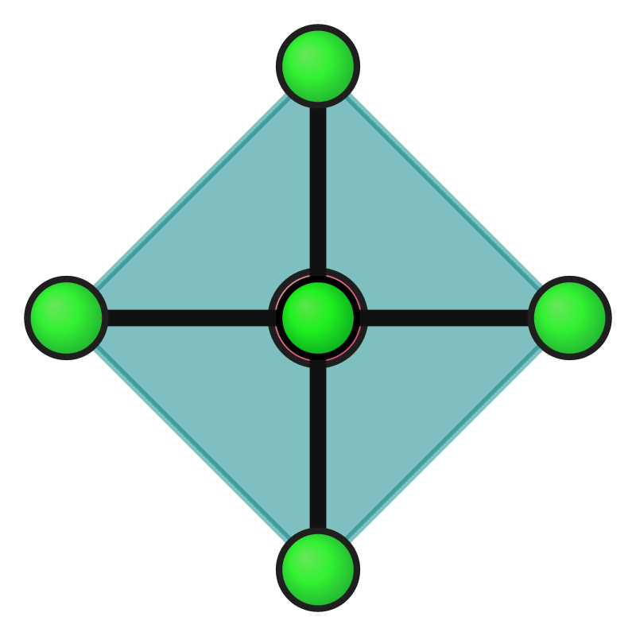
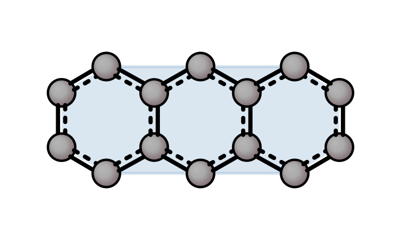

# Convex hull, faces & pores

Draw the convex hull of selected atoms as semi-transparent facets — useful for aromatic rings, coordination spheres, or any subset of atoms. Facets are depth-sorted for correct occlusion. Hull edges that do not coincide with bonds are drawn as thin lines for better 3D perception; disable with `--no-hull-edge`.

Use `--hull` from the CLI (no args = all heavy atoms, `rings` to auto-detect aromatic rings, or 1-indexed atom ranges for subsets), or from Python pass `hull=` to `render()`: `True` for all heavy atoms, `"rings"` for automatic aromatic ring detection (one hull per ring), a flat list of 1-indexed atom indices for one hull, or a list of lists for multiple hulls with optional per-subset `hull_color=["red", "blue"]`. A default color palette cycles automatically for multiple subsets.

| Benzene ring | Anthracene (all ring carbons) | CoCl₆ octahedron |
|--------------|-------------------------------|------------------|
|  |  |  |

| Anthracene ring | Anthracene rot | Auto rings (`hull="rings"`) |
|--------------|------------------|----------------------------|
|  |  |  |

**CLI:**

```bash
# All heavy atoms:
xyzrender benzene.xyz --hull -o benzene_hull.svg

# Single subset (1-indexed atom range):
xyzrender benzene.xyz --hull 1-6 --hull-color steelblue --hull-opacity 0.35 -o benzene_ring_hull.svg

# Multiple subsets with per-hull colors:
xyzrender anthracene.xyz --hull 1-6 4,6-10 8,10-14 -o anthracene_hull.svg

# Auto-detect aromatic rings (one hull per ring, colours cycle automatically):
xyzrender mn-h2.log --ts --hull rings --hull-color teal -o mnh_hull_rings.svg
```

**Python:**

```python
from xyzrender import load, render, render_gif

# Single subset: one hull (e.g. benzene ring carbons, 1-indexed)
benzene = load("structures/benzene.xyz")
render(benzene, hull=[1, 2, 3, 4, 5, 6],
       hull_color="steelblue", hull_opacity=0.35, output="images/benzene_ring_hull.svg")
render_gif(benzene, gif_rot="y", hull=[1, 2, 3, 4, 5, 6],
           hull_color="steelblue", hull_opacity=0.35, output="images/benzene_ring_hull.gif")

# Multiple subsets with per-subset colors (1-indexed):
render(mol, hull=[[1, 2, 3, 4, 5, 6], [7, 8, 9, 10, 11, 12]],
       hull_color=["steelblue", "coral"], hull_opacity=0.35,
       output="anthracene_hull.svg")

# Auto-detect aromatic rings — each ring gets its own hull:
render(mol, hull="rings", hull_color="teal")
```

**Options (passed to `render()`):**

| Option | Description |
|--------|-------------|
| `hull` | `True` = all heavy atoms; `"rings"` = auto-detect aromatic rings; `"faces"` = structural face detection; flat list = one subset; list of lists = multiple hulls |
| `hull_color` | Single string or list of strings for per-subset colours (default palette cycles automatically) |
| `hull_color_type` | Ring colouring mode: `"type"` (default, by atom types + size), `"size"` (by ring size only), `"env"` (type + ring fusion) |
| `hull_opacity` | Fill opacity for all hull surfaces |
| `hull_edge` | Draw non-bond hull edges as thin lines (default: `True`) |
| `hull_edge_width_ratio` | Edge stroke width as fraction of bond width |

## Face detection

Detect structural ring faces in the molecular graph — planar rings in 2D sheets (graphene, COFs) and roughly-planar rings in 3D structures (MOFs, zeolites, buckyballs). Each face is rendered as an ordered polygon (not a convex hull), so concave rings display correctly. Faces are automatically coloured by ring fingerprint (size + element types).

For 3D structures, face traversal runs from 6 uniformly spaced viewing directions to catch faces at any orientation. Non-planar projection artefacts are filtered by a planarity tolerance (`--face-planarity`, default 0.25).

| Buckyball faces (12x5 + 20x6) | MOF-5 faces (60x6) |
|-------------------------------|---------------------|
|  |  |

**CLI:**

```bash
# Structural faces:
xyzrender buckyball.xyz --hull faces -o buckyball_faces.svg

# MOF with periodic cell (--no-cell hides the box):
xyzrender MOF-5.xyz --hull faces --no-cell -o mof5_faces.svg

# Adjust planarity tolerance (stricter = fewer faces):
xyzrender MOF-5.xyz --hull faces --face-planarity 0.1 -o mof5_strict.svg

# Filter small rings:
xyzrender MOF-5.xyz --hull faces --ring-min-size 5 -o mof5_no_small.svg
```

**Python:**

```python
from xyzrender import load, render

mol = load("MOF-5.xyz")
render(mol, hull="faces", no_cell=True, output="mof5_faces.svg")

# Adjust face planarity and ring size filtering:
render(mol, hull="faces", face_planarity=0.1, ring_min_size=5, output="mof5_strict.svg")
```

## Pore detection

Detect 3D pore cavities in frameworks (MOFs, zeolites) and render inscribed spheres at pore centres. Uses coarse-grained topology: the molecular graph is simplified (prune leaves, contract chains, merge metal clusters), then shortest cycles in the cluster-net define pore windows. For periodic structures, the detection is PBC-aware (3×3×3 tiling of cluster centroids).

| Buckyball pore | MOF-5 pore | MOF-5 faces + pore | Rotation |
|----------------|------------|--------------------|-----------| 
|  |  |  |  |

**CLI:**

```bash
# Pore sphere only:
xyzrender MOF-5.xyz --pore --no-cell -o mof5_pore.svg

# Faces + pore sphere:
xyzrender MOF-5.xyz --hull faces --pore --no-cell -o mof5_faces_pore.svg

# Customise pore sphere:
xyzrender MOF-5.xyz --pore --pore-color coral --pore-opacity 0.3 -o mof5_pore_custom.svg

# Animated rotation with faces + pore:
xyzrender MOF-5.xyz --hull faces --pore --no-cell --gif-rot
```

**Python:**

```python
from xyzrender import load, render, render_gif

mol = load("MOF-5.xyz")

# Pore sphere:
render(mol, pore=True, no_cell=True, output="mof5_pore.svg")

# Faces + pore:
render(mol, hull="faces", pore=True, no_cell=True, output="mof5_faces_pore.svg")

# Animated:
render_gif(mol, hull="faces", pore=True, no_cell=True, gif_rot="y", output="mof5.gif")
```

**Pore options (passed to `render()`):**

| Option | Description |
|--------|-------------|
| `pore` | Enable pore sphere detection and rendering |
| `pore_color` | Pore sphere colour (default: `"#f0d060"` warm yellow) |
| `pore_opacity` | Pore sphere opacity (default: 0.5) |
| `face_planarity` | SVD planarity tolerance for 3D face filtering (default: 0.25) |
| `ring_min_size` / `ring_max_size` | Ring size range for face/pore detection |
