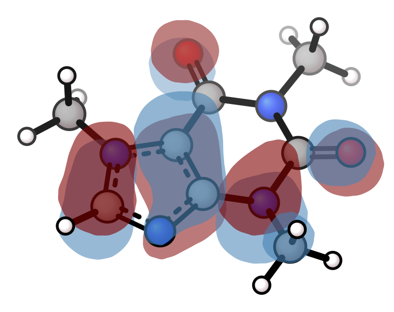

# Molecular Orbitals

Render MO lobes from `.cube` or `.cub` files with `--mo`. The cube file contains both geometry and the orbital grid — no separate XYZ file needed.

When auto-orientation is active (default), the molecule is tilted 45° around the x-axis after alignment so lobes above and below the molecular plane are clearly visible. Use `--no-orient` to render in raw cube coordinates, or `-I` to use the [v viewer](https://github.com/briling/v) for interactive orientation.

Cube files are typically generated by [ORCA](https://www.faccts.de/docs/orca/6.1/manual/contents/utilitiesvisualization/utilities.html?q=orca_plot&n=0#orca-plot) (`orca_plot`) or Gaussian (`cubegen`).

| HOMO | LUMO |
|------|------|
|  |  |

| HOMO + H (iso 0.03) | HOMO rotation |
|--------------------|--------------|
|  |  |

```bash
xyzrender caffeine_homo.cube --mo -o caffeine_homo.svg
xyzrender caffeine_lumo.cube --mo --mo-colors maroon teal -o caffeine_lumo.svg
xyzrender caffeine_homo.cube --mo --hy --iso 0.03 -o homo_iso_hy.svg
xyzrender caffeine_homo.cube --mo --gif-rot -go caffeine_homo.gif
```

## Surface styles

All contour-based surfaces (MO, density, NCI) support alternative rendering styles via `--surface-style`:

| Mesh | Contour | Dot |
|------|---------|-----|
|  |  |  |

```bash
xyzrender caffeine_homo.cube --mo --surface-style mesh
xyzrender caffeine_homo.cube --mo --surface-style contour
xyzrender caffeine_homo.cube --mo --surface-style dot
```

| Style | Description |
|-------|-------------|
| `solid` (default) | Filled surfaces with depth cueing |
| `mesh` | Warped grid lines emulating a 3D wireframe |
| `contour` | Iso-value contour rings showing surface depth |
| `dot` | Stippled contour rings (dots denser toward centre) |

## MO flags

| Flag | Description |
|------|-------------|
| `--mo` | Enable MO lobe rendering (required for `.cube` or `.cub` input) |
| `--iso` | Isosurface threshold (default: 0.05 — smaller value = larger lobes) |
| `--opacity` | Surface opacity multiplier (default: 1.0) |
| `--surface-style STYLE` | Surface rendering style: `solid`, `mesh`, `contour`, `dot` |
| `--mo-colors POS NEG` | Lobe colors as hex or [named color](https://matplotlib.org/stable/gallery/color/named_colors.html) (default: `steelblue` `maroon`) |
| `--flat-mo` | Disable depth classification — render all lobes as front-facing |
| `--mo-blur SIGMA` | Gaussian blur sigma for lobe smoothing (default: 0.8, ADVANCED) |
| `--mo-upsample N` | Upsample factor for contour resolution (default: 3, ADVANCED) |
