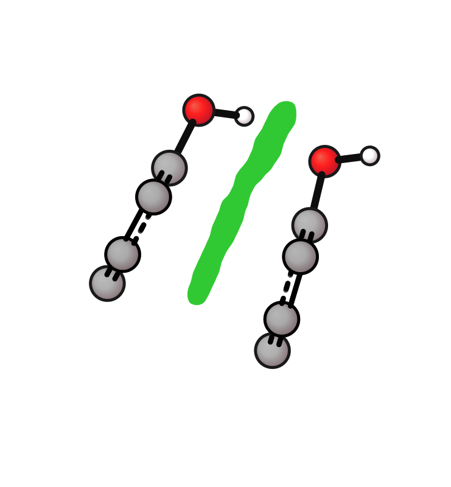
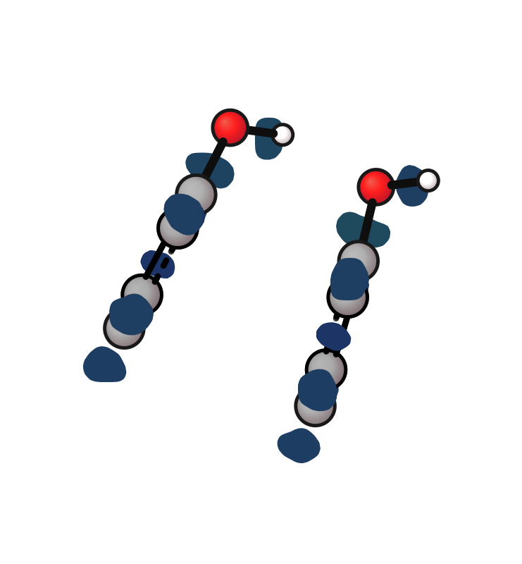
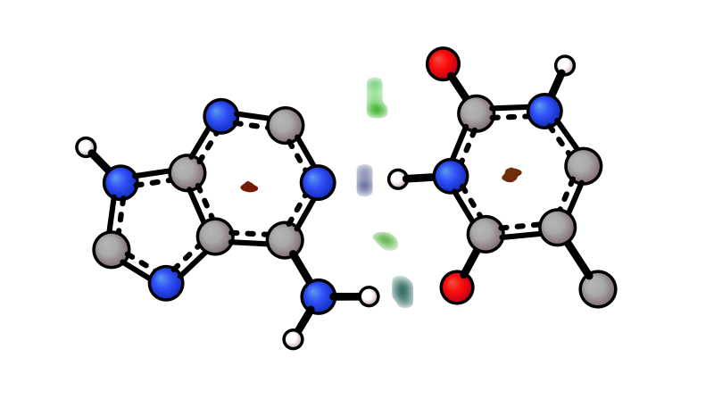

# NCI Surface

```{note}
Surface plots are schematic 2D representations suitable for figures. For quantitative isosurface analysis, use a dedicated 3D viewer (VMD, PyMOL).
```

Visualise non-covalent interaction surfaces from a signed colouring field as the main input plus a second cube that defines the surface geometry.

`--nci-surf` now auto-classifies the surface cube as either:

- `low_field`: points of interest are low, so the surface is extracted with `data < iso`
- `high_field`: points of interest are high, so the surface is extracted with `data > iso`

This means the same flag works for both low-field analyses such as standard [NCIPlot](https://github.com/juliacontrerasgarcia/NCIPLOT-4.2), and high-field analyses such as Multiwfn-style `δg` surfaces.

For standard NCIPlot output, use `sign(λ₂)·ρ` density as the main input and reduced density gradient as `--nci-surf`. These cubes are typically classified as `low_field`.

As an alternative analysis technique, Multiwfn-style `δg` surfaces use `sl2r.cub` as the main input and `dg.cub`, `dg_inter.cub`, or `dg_intra.cub` as `--nci-surf`. These cubes are typically classified as `high_field`.

```{note}
The default `--iso` values are *starting points*, not universal thresholds. They reflect the original NCIPLOT (RDG = 0.3) and Multiwfn IGMH (δg = 0.005) literature conventions. In practice you will need to tune `--iso` per cube — especially for IGMH, where `dg_intra` cubes have a much larger value range than `dg_inter` and typically need `--iso` between 0.05 and 0.3 for clean surfaces.
```

The surface is rendered as individual flat-filled patches per interaction region. Coloring is based on the sign of `λ₂` weighted by density: **blue** = strong attractive (H-bond), **green** = weak/vdW, **red** = repulsive (steric).

| H-bond (base pair) | π-stacking (phenol dimer) |
|-------------------|--------------------------|
|  |  |

```bash
# avg coloring (default): blue=H-bond, green=vdW, red=steric
xyzrender base-pair-dens.cube --nci-surf base-pair-grad.cube -o base-pair-nci_surf.svg
xyzrender phenol_di-dens.cube --nci-surf phenol_di-grad.cube -o phenol_di-nci_surf.svg

# per-pixel (more detail)
xyzrender base-pair-dens.cube --nci-surf base-pair-grad.cube --nci-mode pixel

# flat color (default: forestgreen)
xyzrender base-pair-dens.cube --nci-surf base-pair-grad.cube --nci-mode uniform

# flat color with custom colour
xyzrender base-pair-dens.cube --nci-surf base-pair-grad.cube --nci-mode teal
```

As an alternative analysis technique, IGMH-style interaction surfaces can be similarly visualised using `--nci-surf` alongside an `sl2r.cub` colouring field. The examples below use phenol dimer `dg_inter` and `dg_intra` cubes to show intermolecular and intramolecular interactions separately.

| IGMH Inter (`dg_inter`, `--iso 0.005`) | IGMH Intra (`dg_intra`, `--iso 0.2`) |
|-----------------------------------------|---------------------------------------|
|  |  |

```bash
# intermolecular interaction surface
xyzrender phenol_di-sl2r.cub --nci-surf phenol_di-dg_inter.cub --iso 0.005 -o phenol_di_igmh_inter.svg

# intramolecular interaction surface
xyzrender phenol_di-sl2r.cub --nci-surf phenol_di-dg_intra.cub --iso 0.2 -o phenol_di_igmh_intra.svg
```

Coloring modes (`--nci-mode`):

| Pixel (base pair) |
|-------------------|
|  |

```bash
xyzrender base-pair-dens.cube --nci-surf base-pair-grad.cube --nci-mode pixel -o base-pair-nci_pixel.svg
```

| Mode | Description |
|------|-------------|
| `avg` (default) | Each NCI lobe filled with its mean `sign(λ₂)·ρ`: **blue** = H-bond, **green** = vdW, **red** = steric |
| `pixel` | Per-pixel `sign(λ₂)·ρ` raster — shows intra-lobe variation |
| `uniform` | Flat single color for all NCI regions (default: `forestgreen`) |
| *colour* | Any colour name or hex — shorthand for uniform mode with that colour |

Surface styles also work on NCI patches:

| Mesh |
|------|
|  |

```bash
xyzrender base-pair-dens.cube --nci-surf base-pair-grad.cube --surface-style mesh
```

All interaction surface flags:

| Flag | Description |
|------|-------------|
| `--nci-surf SURFACE_CUBE` | Interaction surface cube file. Auto-classified as `low_field` or `high_field` from the cube values |
| `--nci-mode MODE` | Coloring: `avg` (default), `pixel`, `uniform`, or a colour name/hex |
| `--iso` | Surface isovalue threshold (starting point — tune per cube). Low-field (NCIPLOT RDG) renders regions *below* the cutoff (default `0.3`). High-field (Multiwfn IGMH δg) renders regions *above* the cutoff: default `0.005` for `dg_inter`; `dg_intra` typically needs `0.05`–`0.3` |
| `--opacity` | Surface opacity multiplier (default: 1.0) |
| `--surface-style STYLE` | `solid` or `mesh` recommended; `contour`, `dot` also available. These use avg lobe colour |
| `--nci-cutoff CUTOFF` | Density magnitude cutoff (advanced — not needed for standard NCIPLOT output) |

Sample structures from [NCIPlot](https://github.com/juliacontrerasgarcia/NCIPLOT-4.2/tree/master/tests).
