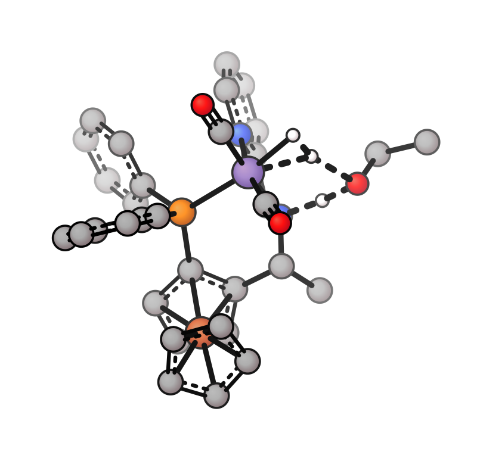
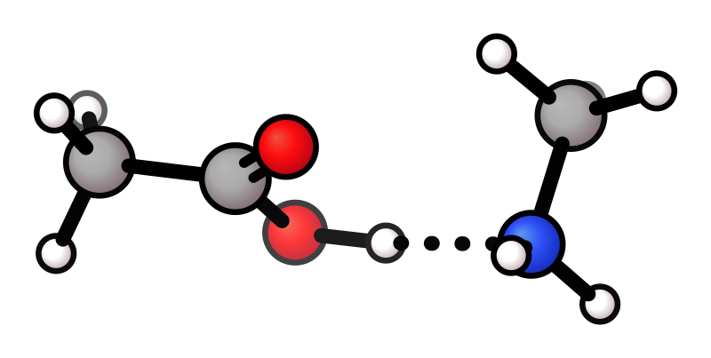
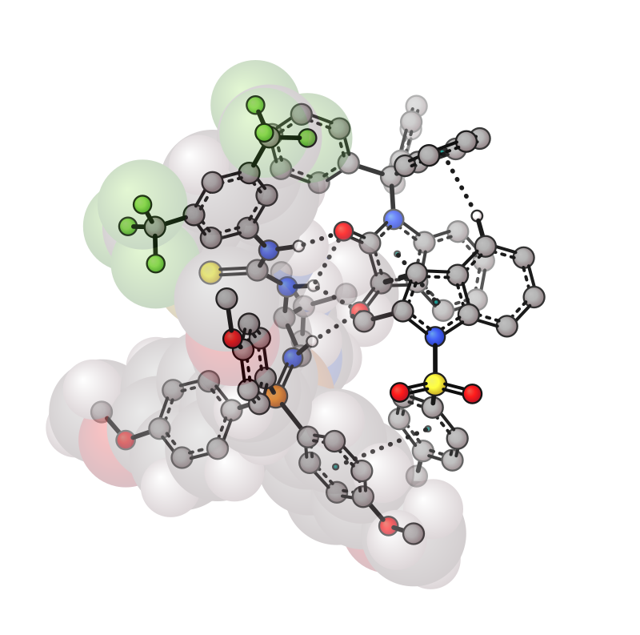

# Transition States and NCI

xyzrender uses [xyzgraph](https://github.com/aligfellow/xyzgraph) for molecular graph construction from Cartesian coordinates — determining bond connectivity, bond orders, detecting aromatic rings, and non-covalent interactions. It also provides element data (van der Waals radii, atomic numbers) used throughout rendering.

Transition state analysis uses [graphRC](https://github.com/aligfellow/graphRC) for internal coordinate vibrational mode analysis. Given a QM output file (ORCA, Gaussian, etc.), graphRC identifies which bonds are forming or breaking at the transition state with `--ts`. These are rendered as dashed bonds. graphRC is also used to generate TS vibration frames for `--gif-ts` animations.

> **Python.** Most `xyzrender` flags map 1:1 to keyword arguments on `render()` / `render_gif()`. Two things to note here: `--ts` (and `--nci-detect`) are **`load()`** options — `mol = load("sn2.out", ts_detect=True)` — while the *manual* overlay bonds are `render()` kwargs passed as 1-indexed tuples (`ts_bonds=[(1, 2)]`) rather than a `"1-2"` string. See the [Python API guide](../python_api.md) for the load/render split.

## Transition states

`--ts` auto-detects forming/breaking bonds from QM output. TS bonds are rendered as dashed lines.

| Auto TS | Manual TS bond |
|---------|---------------|
|  |  |

```bash
xyzrender sn2.out --ts --hy -o sn2_ts.svg
xyzrender sn2.out --ts-bond "1-2" -o sn2_ts_man.svg    # specific bond only
xyzrender sn2.out --ts --ts-color dodgerblue -o sn2_ts_blue.svg
```

```python
mol = load("sn2.out", ts_detect=True)            # equivalent to --ts at load-time
render(mol, hy=True, output="sn2_ts.svg")

render("sn2.out", ts_bonds=[(1, 2)], output="sn2_ts_man.svg")  # 1-indexed tuple list
render("sn2.out", ts_bonds=[(1, 2), (3, 4)], ts_color="dodgerblue")
```

## QM output files

| ORCA output | Gaussian TS |
|-------------|------------|
|  |  |

```bash
xyzrender bimp.out -o bimp_qm.svg
xyzrender mn-h2.log --ts -o mn-h2_qm.svg
```

## NCI interactions (`--nci`)

`--nci` uses [xyzgraph](https://github.com/aligfellow/xyzgraph)'s `detect_ncis` to identify hydrogen bonds, halogen bonds, pi-stacking, and other non-covalent interactions from geometry. These are rendered as dotted bonds.

For pi-system interactions (e.g. pi-stacking, cation-pi), centroid dummy nodes are placed at the mean position of the pi-system atoms. For trajectory GIFs with `--nci`, interactions are re-detected per frame.

| Auto NCI | Manual NCI bond |
|----------|----------------|
|  |  |

```bash
xyzrender Hbond.xyz --hy --nci -o nci.svg                 # auto-detect all NCI
xyzrender Hbond.xyz --hy --nci-bond "8-9" -o nci_man.svg  # specific bond only
xyzrender Hbond.xyz --hy --nci --nci-color teal -o nci_teal.svg
```

```python
mol = load("Hbond.xyz", nci_detect=True)          # equivalent to --nci at load-time
render(mol, hy=True, output="nci.svg")

render("Hbond.xyz", nci_bonds=[(8, 9)], hy=True)  # 1-indexed tuple list
```

## NCI + TS combined

| Default colours | Custom colours |
|-----------------|---------------|
|  |  |

```bash
xyzrender bimp.out --ts --nci --vdw 84-169 -o bimp_ts_nci.svg
xyzrender bimp.out --ts --nci -vdw 84-169 --ts-color magenta --nci-color teal -o bimp_ts_nci_custom.svg
```

## Styling controls

TS and NCI/haptic styling has three independent axes — **colour**, **dash pattern**, and **line width** — plus a TS/NCI categorisation. Haptic always follows NCI's controls.

### Colour

Two ways to set it:

1. **Flat colour** (`--ts-color` / `--nci-color`) — single hex or named colour for every dash/dot.
2. **Atom-coloured halves** (`--ts-element` / `--nci-element`) — each dash/dot splits into two halves coloured by the endpoint atoms (the same gradient solid bonds use under `bond_color_by_element`). Off by default for TS; on by default for NCI in `pmol`/`btube`/`tube`/`mtube` presets.

Resolution: `--ts-color` / `--nci-color` always wins; otherwise the element split applies when the toggle is on **and** the preset has `bond_color_by_element=True`; otherwise the bond falls back to the default bond colour.

```bash
xyzrender bimp.out --ts --nci --config pmol                       # NCI element split (preset default)
xyzrender bimp.out --ts --nci --config pmol --ts-element           # add TS element split
xyzrender bimp.out --ts --nci --config pmol --no-nci-element       # opt back out
xyzrender bimp.out --ts --nci --ts-color red --nci-color teal     # flat colours
```

### Dash pattern (`--ts-dash`, `--nci-dash`)

`LEN,GAP` — both numbers are multiples of `bond_width`. Position 0 is the dash/dot **length** (drawn segment), position 1 is the **gap** (empty segment).

| Default | Visual |
|---------|--------|
| `--ts-dash 1.2,2.2`  | medium dashes with a moderate gap |
| `--ts-dash 2.5,1.0`  | long dashes, near-continuous |
| `--ts-dash 0.4,2.0`  | short dashes / large gap (sparser) |
| `--nci-dash 0.08,2.0` | dots with even spacing (default) |
| `--nci-dash 0.3,1.5` | bigger dots, tighter spacing |

Python: accepts string `"1.2,2.2"` or tuple `(1.2, 2.2)`. JSON: array `[1.2, 2.2]`.

### Line width (`--ts-width`, `--nci-width`)

`MULT` — line stroke width as a multiple of `bond_width`. Defaults: TS = `1.2` (slightly thicker than bonds), NCI = `1.0` (same as bonds).

```bash
xyzrender sn2.out --ts --config pmol --ts-width 0.5  # thinner TS dashes
xyzrender sn2.out --ts --config pmol --ts-width 2.0  # thicker, prominent
```

Dash length and line width are independent — changing `--ts-width` does not rescale `--ts-dash`.
